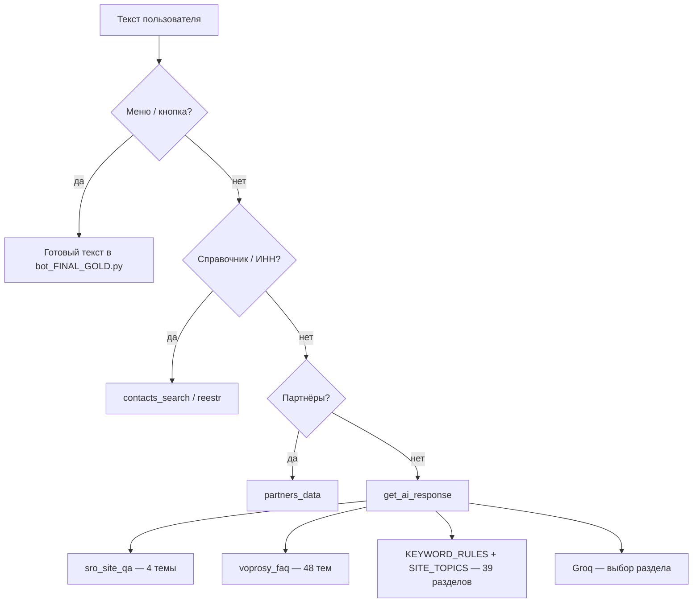

# Отчёт: база ответов Telegram-бота СРО «ГЕН»

**Дата:** 21.07.2026  
**Версия бота:** `2026-07-22-v50`  
**Назначение:** для куратора и руководства — что уже «зашито» в боте, откуда берутся ответы, как считать объём.

---

## 1. Резюме (цифры)

| Показатель | Количество | Файл / модуль |
|------------|------------|---------------|
| **Готовые Q&A** (краткий текст + ссылка на сайт) | **48** | `voprosy_faq.py` |
| **Узкие блоки про разделы сайта** | **4** | `sro_site_qa.py` |
| **Итого отдельных «карточек» FAQ/сайт** | **52** | |
| **Разделы сайта с подсказкой и URL** | **39** | `ai_assistant.py` → `SITE_TOPICS` |
| **Темы быстрого поиска по фразам** | **36** | `KEYWORD_RULES` |
| **Фраз-триггеров** (варианты вопросов) | **~274** | `KEYWORD_RULES` |
| **Готовые тексты по кнопкам меню** | **~15** | `bot_FINAL_GOLD.py` |

**Важно:** 52 + 39 — **не** 91 уникальный юридический ответ. Часть тем дублируется (например, «возврат взноса» есть и в FAQ, и в меню, и в ключевых словах) — это **разные входы** к одному смыслу.

**ИИ (Groq):** не хранит отдельную базу ответов. При неоднозначном запросе модель **выбирает один из 39 разделов** `SITE_TOPICS` или возвращает «точного ответа нет» + контакты Ассоциации.

**Не входит в «базу ИИ»:** поиск по **ИНН/организациям** (реестр + планы), **телефонный справочник** (ФИО), **партнёры и НО** (отдельный справочник сайтов).

---

## 2. Как пользователь получает ответ (логика)

Приоритет в коде: партнёры → локальные ключевые слова → `sro_site_qa` → `voprosy_faq` → Groq.

---

## 3. Блок «Вопрос-ответ» на сайте — 48 тем

Источник: [srogen.ru/voprosy/](https://www.srogen.ru/voprosy/).  
В боте: краткий ответ (`short`) + ссылка на страницу + подсказка, какой вопрос искать на сайте.

1. Что даёт компании членство в СРО?
2. Какие условия вступления и членства в СРО?
3. Выдаёт ли СРО допуск на особо опасные и сложные объекты?
4. Зачем вообще нужно вступать в СРО?
5. По каким основаниям исключают из членов СРО?
6. Какие требования к кадрам для строительного контроля на сложных объектах?
7. Когда применяют исключение из СРО как меру дисциплинарного воздействия?
8. В каких случаях идут выплаты из компенсационного фонда?
9. Какая СРО платит по вреду — генподрядчика или субподрядчика?
10. Можно ли учесть взносы в СРО в расходах по налогу на прибыль?
11. Какие строительные стандарты применяют в Европейском союзе?
12. Нужно ли сообщать в налоговую о вступлении в СРО?
13. Действуют ли уже актуализированные СНиП?
14. Нужно ли вносить сведения о членстве в СРО в Федресурс?
15. Нужно ли генподрядчику допуск на работы, которые выполняет субподрядчик?
16. Почему нельзя вернуть взнос в компфонд при выходе из СРО?
17. Нужен ли допуск, если строите на своём объекте своими силами?
18. Нужен ли допуск застройщику для строительного контроля своими силами?
19. Нужен ли допуск при работах на части особо опасного объекта?
20. Нужен ли допуск для аукциона на дом до трёх этажей?
21. Как считают минимальную численность персонала для допуска на сложные объекты?
22. Как часто СРО проверяет своих членов?
23. С какого момента считается стаж работы по специальности?
24. Принимают ли иностранные дипломы для допуска в СРО?
25. Засчитывается ли обучение Ростехнадзора как повышение квалификации?
26. Где на сайте посмотреть актуализированные СНиП?
27. Какие меры дисциплинарного воздействия бывают в СРО?
28. Как изменилось техническое регулирование после техрегламента зданий?
29. Что такое Еврокоды и как они применяются?
30. Можно ли внедрить Еврокоды в России без национальных приложений?
31. Какими документами определены формы оценки соответствия в строительстве?
32. Где узнать о семинарах СРО и как на них записаться?
33. Обязательно ли заявление о соответствии построенного объекта?
34. Есть ли на сайте архив старых редакций документов СРО?
35. Можно ли приостановить допуск на время простоя компании?
36. Платят ли из компфонда, если виновных лиц не нашли?
37. Можно ли на УСН уменьшить доход на взнос в компфонд?
38. Можно ли ставить штамп СРО на заявление об изменении допуска для тендера?
39. Какой документ СРО подтверждает взнос в КФ для налогового учёта?
40. Можно ли проценты по компфонду направить на снижение членских взносов?
41. Войдут ли новые нормы в обязательный перечень по техрегламенту?
42. Изменятся ли требования к образованию из‑за бакалавриата и магистратуры?
43. Как получить выписку из реестра с указанием видов работ?
44. Можно ли переоформить членство после присоединения к компании вне СРО?
45. Сохраняется ли членство при преобразовании юрлица?
46. Можно ли вести строительный контроль по договору без членства в СРО?
47. Нужно ли членство в СРО для обследования строительных конструкций?
48. Всегда ли нужно членство в СРО для проектной документации?

---

## 4. Узкие ответы про навигацию по сайту — 4 темы

| № | Тема |
|---|------|
| 1 | Где на сайте устав, стандарты и свидетельства СРО |
| 2 | Что такое СРО «ГЕН» и чем отличается от партнёрских СРО |
| 3 | Где на сайте законы и нормативные акты |
| 4 | Где на сайте техрегулирование и технические регламенты |

---

## 5. Разделы сайта (ИИ-помощник) — 39 направлений

К каждому привязаны URL и описание для подбора по ключевым словам и Groq:

Благотворительность; бланки (вступление, проверка, ОДО, реестр); внесение в реестр специалистов; возврат взноса; вступление и взносы; документы НРС; жалобы; законодательство; контакты; контроль СРО; личный кабинет; НОК; новости; о СРО и членстве; организация контроля; партнёры; перечень документов для проверки; план и результаты проверок; подготовка к НОК; выписка; реестры НОСТРОЙ/НОПРИЗ/членов; НРС; сроки вступления; строительство для себя; требования к специалистам; устранение нарушений; филиалы.

Полный перечень с техническими id — в `ai_assistant.py`, словарь `SITE_TOPICS`.

---

## 6. Ключевые фразы (без Groq)

**36** тем, **~274** варианта формулировок (опечатки, синонимы, сленг вроде «комфонд»).  
Примеры тем: `plan_proverok`, `vznosy`, `vozvrat_vznosa`, `o_sro`, `blanki_odo`, `partnery`.

---

## 7. Меню бота (не «ИИ», но готовые ответы)

Кнопки с фиксированным текстом в `bot_FINAL_GOLD.py`, в том числе:

- Возврат взноса; строительство для себя; подготовка к НОК; выписка; личный кабинет  
- Размеры взносов (КФ); правила сдачи НОК; об Ассоциации; жалобы  
- Расписание проверок; как вступить; проверяемые документы  

Плюс разделы: контакты отделов, полезная информация / FAQ, поиск организации, партнёры.

---

## 8. Качество и сопровождение

| Инструмент | Назначение |
|------------|------------|
| `routing_regression.py` | 16 автопроверок маршрутизации (справочник vs ИИ) |
| `KURATOR_BOT_ROL.md` §6 | Чек-лист в Telegram после обновления |
| `IT_ZAYAVKA_DEPLOY.md` §13 | Полная регрессия для IT/куратора |

**Роль куратора при расширении:** новые вопросы с сайта → `voprosy_faq.py`; новые «куда на сайте» → `sro_site_qa.py` или `SITE_TOPICS`; разговорные фразы → `KEYWORD_RULES` или `phrases` в FAQ.

---

## 9. Ограничения (для ожиданий руководства)

- Бот **не заменяет** юриста/куратора СРО: даёт **навигацию** и **типовые** формулировки по материалам Ассоциации.  
- Ответ «точного ответа нет» возможен, если формулировка новая и не попала в ключевые слова/FAQ.  
- Актуальность реестра организаций — файл `reestr_cache.json` (отдельный регламент синхронизации).

---

*Связанные документы: `KURATOR_BOT_ROL.md`, `PREZENTACIYA_SRO_BOT.md`, `IT_ZAYAVKA_DEPLOY.md`.*
